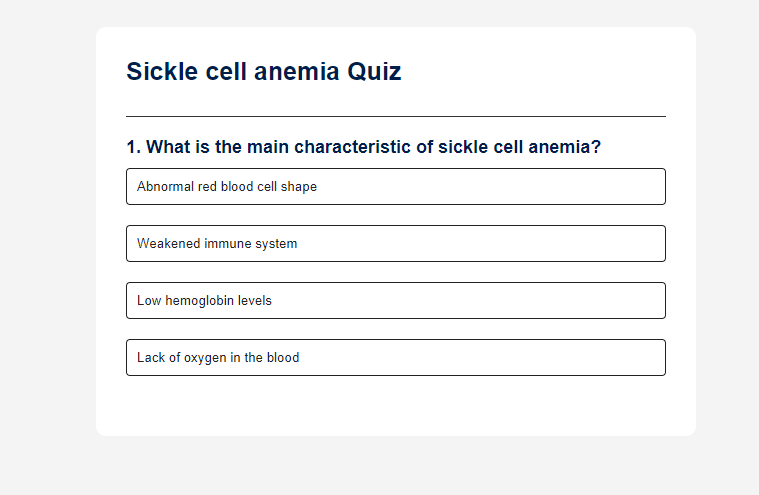

# Quiz App

This is a simple quiz app built with HTML CSS and Javascript.

## Features

- Multiple choice questions
- Score tracking

## Installation

1. Clone the repository: `github.com/Rene-Harry/quizapp`

## Usage

1. Open the app in your browser.
2. Select a quiz category.
3. Answer the questions
4. View your score.
